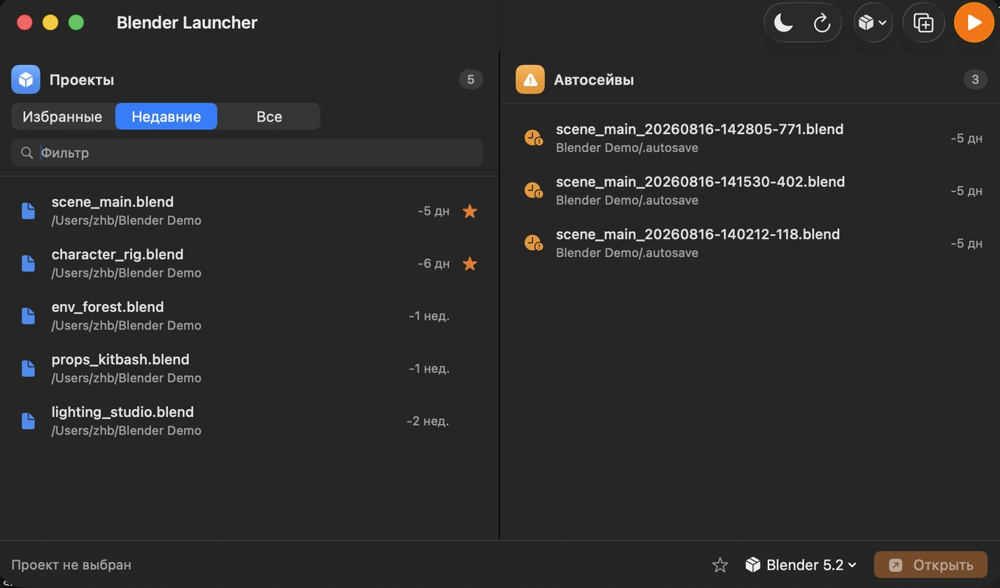
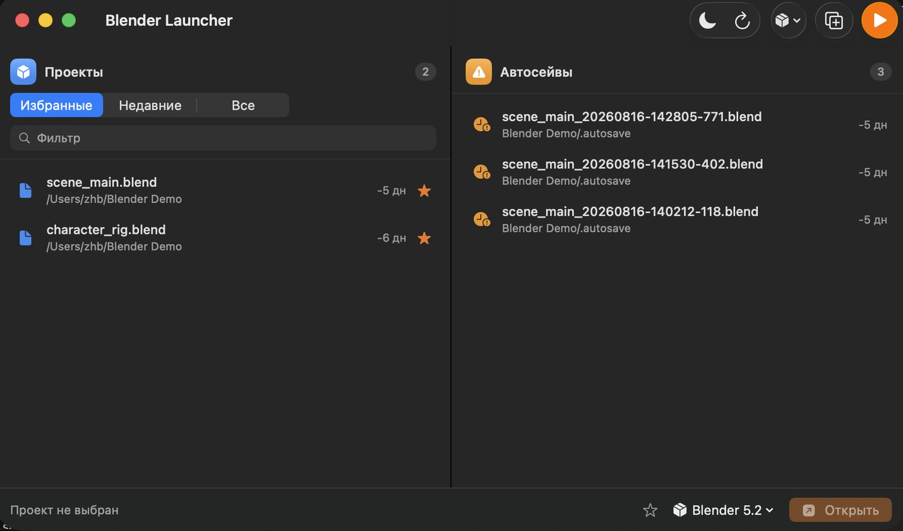
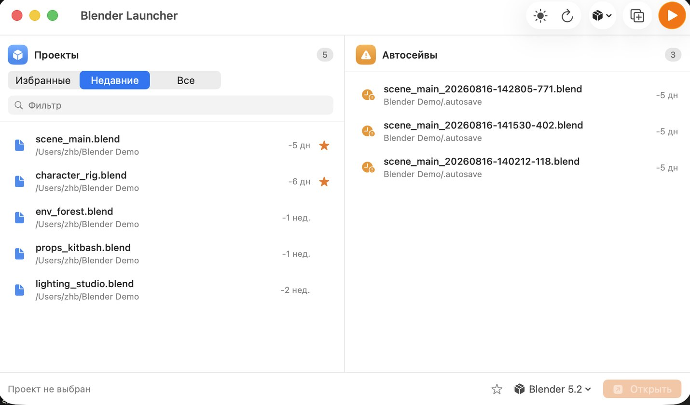

<div align="center">


# Blender Launcher

**Два Blender одновременно. Без терминала.**

[Скачать][latest] · [Сайт проекта][site]


</div>

---

macOS не открывает второй экземпляр Blender: клик по иконке просто возвращает
к уже запущенному окну. Обойти это можно командой в терминале, но каждый раз
писать её неудобно.

Этот лаунчер снимает ограничение одной кнопкой и заодно показывает проекты
и автосейвы **до** того, как Blender вообще запустится.



## Возможности

**Избранные проекты.** Звёздочка у строки закрепляет проект в отдельной вкладке,
чтобы не искать его в общем списке каждый раз. <kbd>⌘D</kbd> добавляет выбранный.



Отметка хранится по пути к файлу, а не по записи в истории Blender — проект
останется в избранном, даже когда Blender вытеснит его из своего списка недавних.
Пропавший файл не исчезает молча: остаётся перечёркнутым с пометкой
«Файл не найден», чтобы было видно, что потерялся именно он.

**Несколько окон Blender.** Отдельный процесс на каждое окно — своя сцена, свой
рендер, свой краш. <kbd>⌘N</kbd> открывает следующее.

**Поиск проектов.** Находит файлы `.blend` по домашней папке через Spotlight —
за доли секунды, включая те, которых нет в истории Blender. Конфиги и пресеты
аддонов отфильтрованы.

**Автосейвы после краша.** Blender хранит их в двух местах, и обычно на виду
только одно. Лаунчер собирает оба — подробнее ниже.

**Несколько версий Blender.** Находит все установки, показывает номера версий.
Старый проект можно открыть той версией, в которой он сделан, не меняя основную.

**Светлая и тёмная тема.** Переключение в один клик, выбор запоминается.

| Тёмная | Светлая |
|---|---|
|  |  |

## Установка

1. Скачайте `Blender-Launcher-macOS-arm64.zip` со [страницы релизов][latest]
   и распакуйте.
2. Перетащите `Blender Launcher.app` в папку «Программы».
3. При первом запуске — правый клик по приложению → «Открыть».

Приложение подписано локально и не проходило нотаризацию Apple, поэтому
Gatekeeper блокирует первый запуск. Открытие через правый клик снимает вопрос
один раз. Альтернатива — снять карантинный атрибут:

```bash
xattr -cr "/Applications/Blender Launcher.app"
```

При первом поиске проектов macOS спросит доступ к папкам. Без него список
найденных файлов останется пустым.

## Где Blender прячет автосейвы

Автосейвы попадают в два разных места, и большинство инструментов показывает
только первое:

| Где | Как выглядит |
|---|---|
| Временная папка системы | `$TMPDIR/<имя>_<PID>_autosave.blend` |
| Рядом с проектом | `<папка проекта>/.autosave/<имя>_<timestamp>.blend` |

Второе место легко пропустить: Spotlight не индексирует скрытые папки. На
рабочей машине это была разница между 2 и 15 найденными автосейвами.

Папка рядом с проектом встречается в двух видах — скрытая `.autosave` и обычная
`autosave`. Скрытую Spotlight не видит, зато содержимое обычной он индексирует,
и без фильтра автосейвы попадают в список проектов. Лаунчер обрабатывает оба
случая: ищет автосейвы в обеих формах и не пускает их в проекты.

Полный обход домашней папки стоил бы около 20 секунд, поэтому лаунчер смотрит
в `.autosave` только внутри директорий, где уже известны проекты — это
несколько десятков проверок вместо рекурсии по всему диску.

## Сборка из исходников

Нужен Swift 5.9+ (входит в Xcode Command Line Tools). Xcode целиком не требуется.

```bash
git clone https://github.com/JustBelieve9/blender-launcher.git
cd blender-launcher
./build.sh
```

Скрипт собирает релизную сборку, упаковывает её в `Blender Launcher.app`
и подписывает ad-hoc. Иконка пересобирается отдельно:

```bash
./Scripts/build_icon.sh
```

### Структура

| Файл | Назначение |
|---|---|
| `Sources/BlenderLauncher/BlenderManager.swift` | Состояние, недавние файлы, запуск процессов |
| `Sources/BlenderLauncher/ProjectScanner.swift` | Поиск `.blend` через `NSMetadataQuery`, обход `.autosave` |
| `Sources/BlenderLauncher/BlenderInstall.swift` | Поиск установок Blender и их версий |
| `Sources/BlenderLauncher/FavoritesStore.swift` | Избранные проекты |
| `Sources/BlenderLauncher/ContentView.swift` | Интерфейс |
| `Sources/BlenderLauncher/Theme.swift` | Цвета и режимы оформления |

## Как обходится ограничение macOS

`NSWorkspace.openApplication` и `open -a` уважают одноэкземплярность приложения:
если процесс уже запущен, система активирует его окно вместо запуска нового.
Лаунчер вместо этого запускает исполняемый файл внутри бандла напрямую:

```swift
let process = Process()
process.executableURL = install.binaryURL   // Blender.app/Contents/MacOS/Blender
process.arguments = [path]                  // необязательный .blend
try process.run()
```

Каждый вызов даёт независимый процесс со своим адресным пространством.

## Требования

- macOS 13 Ventura или новее
- Apple Silicon (arm64) — сборки под Intel нет
- Установленный Blender в `/Applications`, `/Applications/Blender/`
  или `~/Applications`; путь можно указать вручную

---

<details>
<summary>English summary</summary>

macOS refuses to launch a second Blender instance — clicking the icon just
focuses the existing window. This launcher spawns independent instances by
executing the binary inside the bundle directly, and adds a project browser
that reads Blender's recent-files list, finds `.blend` files across the home
folder via Spotlight, and surfaces autosaves from **both** locations Blender
uses (the system temp folder and the `.autosave` directory next to each
project — invisible to Spotlight when hidden).

Projects can be starred into a Favorites tab; the star is stored by file path,
so it survives Blender forgetting the file, and a starred file that goes missing
is shown struck through rather than silently dropped.

Native SwiftUI, no Electron. macOS 13+, Apple Silicon only.
Download from [Releases][latest]; build with `./build.sh`.

</details>

[latest]: https://github.com/JustBelieve9/blender-launcher/releases/latest
[site]: https://justbelieve9.github.io/blender-launcher/
